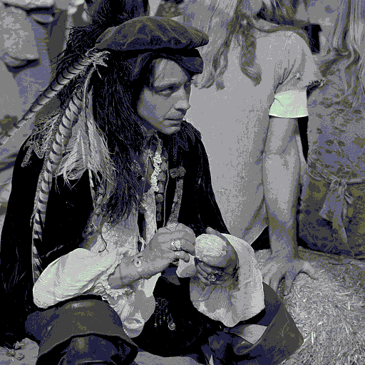
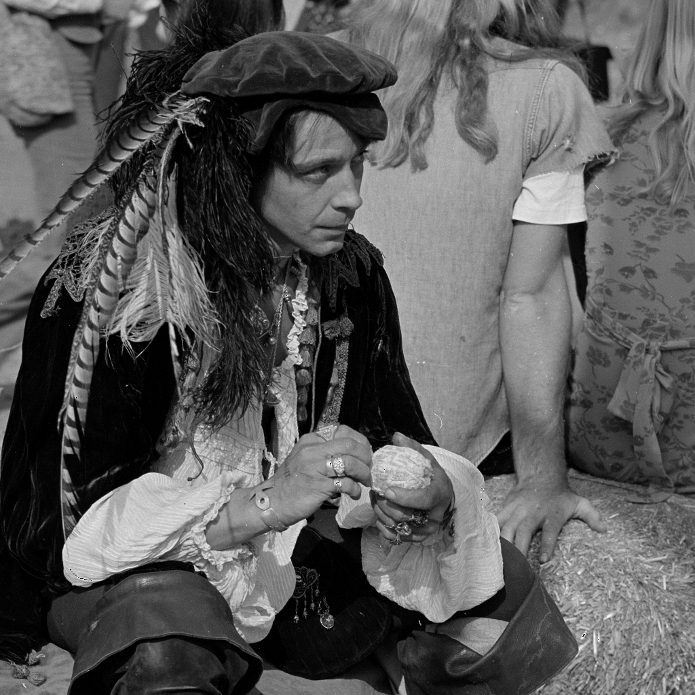
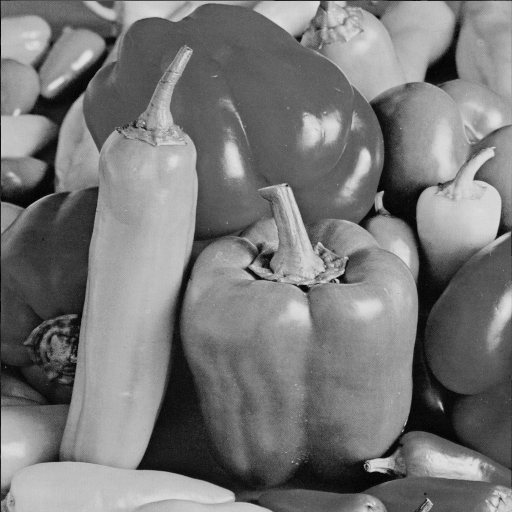

# PySpectra Steganography

PySpectra is a steganography module designed to embed and extract hidden messages within images using Spread Spectrum and LSB (Least Significant Bit) techniques.

## Overview

This Python-based steganography tool offers functionalities to embed secret messages within image files while preserving the visual integrity of the image. It utilizes Spread Spectrum and LSB methods to encode and decode messages seamlessly.

## Features

- **Embedding**: Conceal messages within image files using Spread Spectrum and LSB techniques.
- **Extraction**: Retrieve hidden messages from images while preserving the image's visual quality.
- **Analysis**: Conduct analysis on the image to measure PSNR (Peak Signal-to-Noise Ratio) and SSIM (Structural Similarity Index).

## Usage

1. **Embedding**: Hide a message within an image.
   - Provide the image, message, key, and scalar value.
   - Execute the embedding process.

2. **Extraction**: Retrieve a hidden message from an image.
   - Supply the image and the key used for embedding.
   - Extract the concealed message.

3. **Analysis**: Evaluate image quality metrics.
   - Compare original and modified images.
   - Measure PSNR and SSIM values.

## Installation

1. Clone the repository:

   ```sh 
   git clone https://github.com/snykk/pyspectra-steganography.git
   ```
2. Install the dependecies:
    ```sh
    pip install -r requirements.txt
    ```
3. Run the application:
    ```sh
    python main.py
    ```

## Contributors
This project is open for contributions and suggestions. If you have an idea for a new feature or a bug fix, don't hesitate to open a pull request

## License
This project is licensed under the MIT License. See the [LICENSE](https://github.com/snykk/spread-spectrum-lsb-steganography/blob/master/LICENSE) file for details.

## Result

| Cover | Stego | PSNR | SSIM|
|---|---|---|---|
|  |  | 73.80361845471792 | 0.9999518206752678|
|  |  | 80.58434059598379 | 0.9999988523927771 |
|  |  | 76.80170347669058 | 0.9999982951594725 |
 